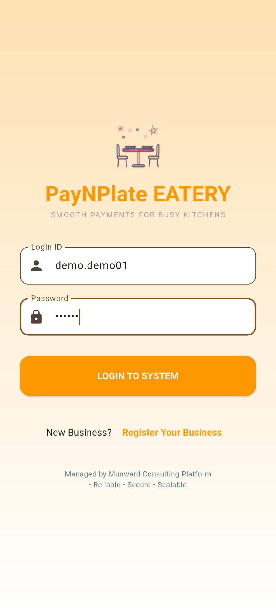
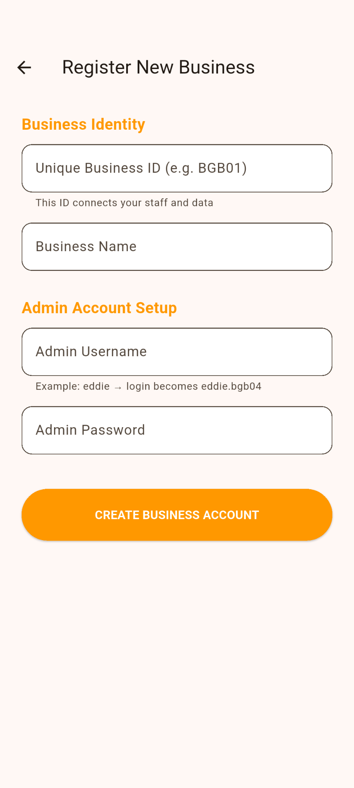
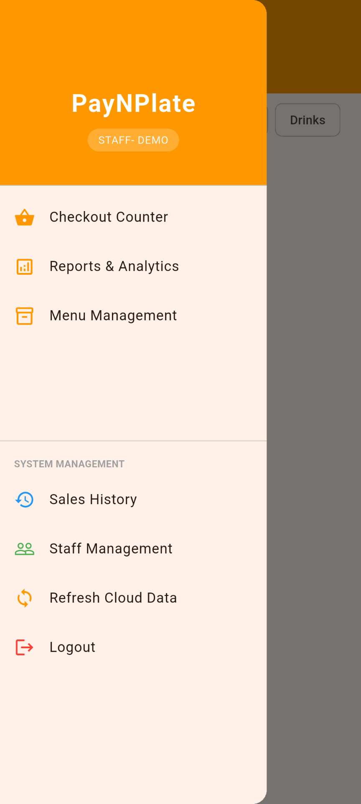
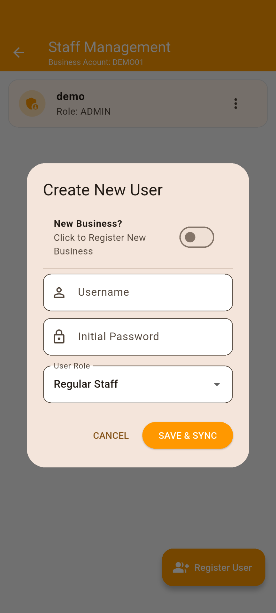
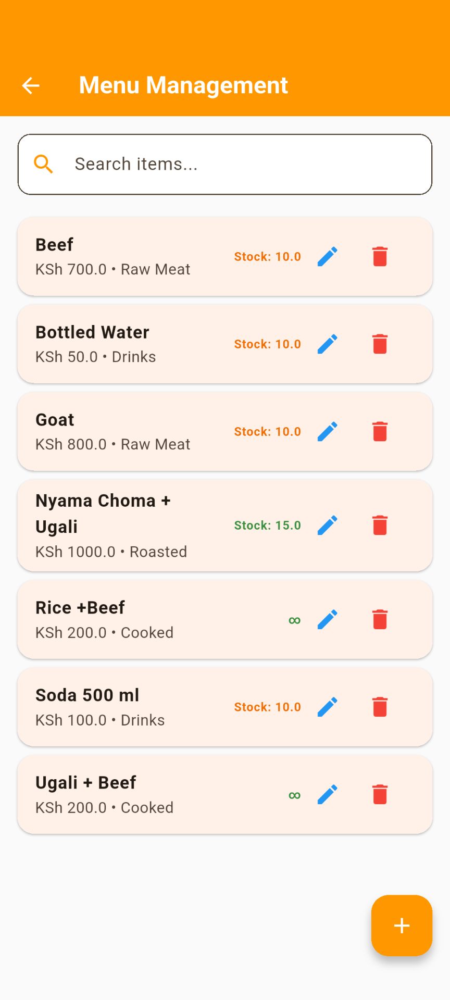
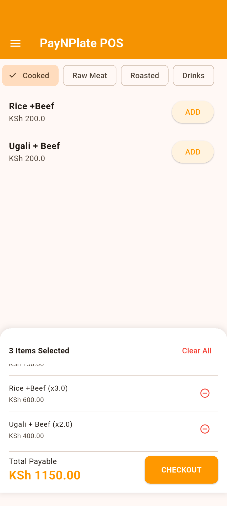
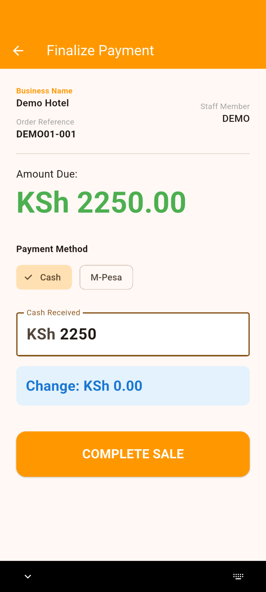
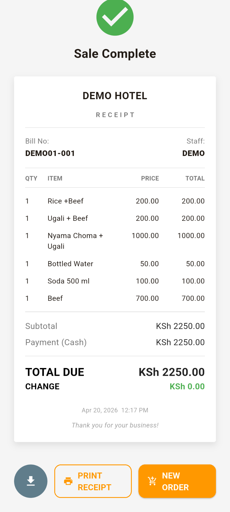
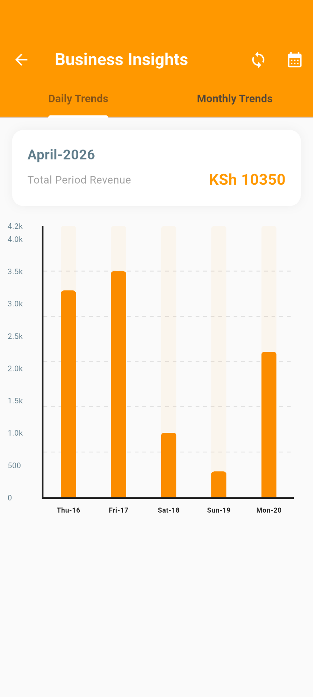
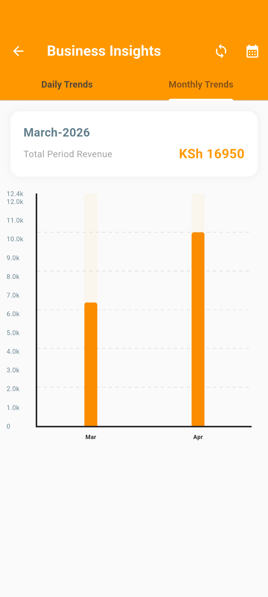

# 🍽️ PayNPlate POS System

A modern, scalable Point of Sale (POS) mobile application built with Flutter, designed for small and medium-sized food businesses.

---

## 🚀 Overview

PayNPlate is a full-featured POS system that enables businesses to manage sales, inventory, staff, and analytics in a single mobile application. It is designed with an **offline-first architecture** and **cloud synchronization**, ensuring reliability even in low-connectivity environments.

---

## ✨ Key Features

### 🔐 Authentication & Multi-Business Support
- Secure login using Firebase Authentication
- Multi-business account structure
- Device-based session control and security

### 👥 Staff Management
- Role-based access (Admin / Staff)
- Staff account creation and control
- Session tracking and device locking

### 📦 Inventory Management
- Product categorization (Cooked, Raw, Drinks, etc.)
- Real-time stock tracking
- Automatic stock deduction during sales

### 💰 Sales & Transactions
- Fast checkout system
- Cart-based order processing
- Multiple payment methods (Cash / M-Pesa)
- Sequential business-based invoice IDs

### 🧾 Receipt System
- PDF receipt generation
- Local receipt storage
- Downloadable receipts for sharing and records
- (Upcoming) Bluetooth 80mm thermal printing

### ☁️ Cloud Synchronization
- Firestore integration for:
  - Products
  - Sales
  - Staff
- Automatic sync between devices

### 📊 Analytics Dashboard
- Daily revenue trends
- Monthly revenue analysis
- Visual charts using `fl_chart`

---

## 🛠️ Tech Stack

- **Frontend:** Flutter (Dart)
- **Backend:** Firebase (Authentication + Firestore)
- **Local Storage:** SQLite (`sqflite`)
- **Charts:** `fl_chart`
- **PDF Generation:** `pdf` & `printing`
- **State Handling:** Stateful widgets + async services

---

## 📱 Screenshots

### 🔐 Login Screen

### 🔐 Business Registration Screen

### 🛒 POS Interface

### 🛒 Staff Registration Interface

### 💳 Checkout / Payment

### 🧾 Receipt Preview

### 📊 Analytics Dashboard

